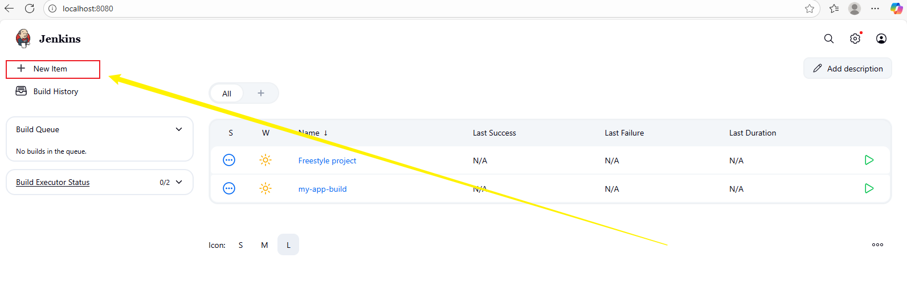
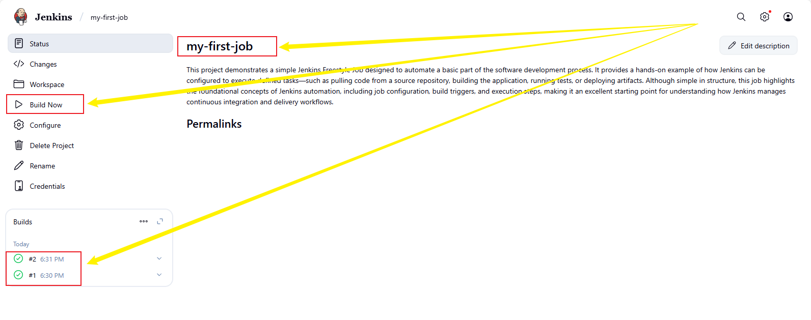
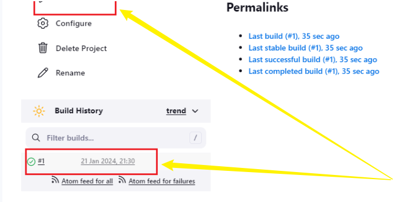
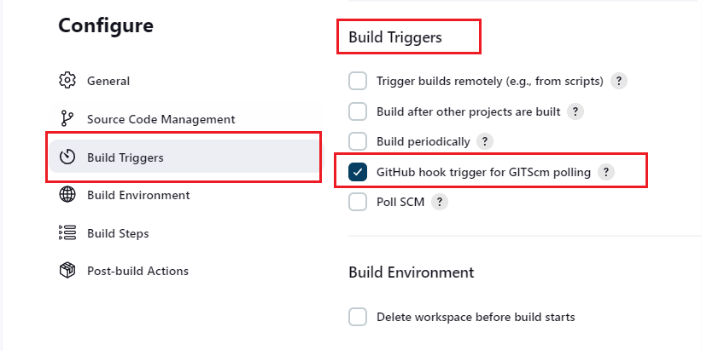
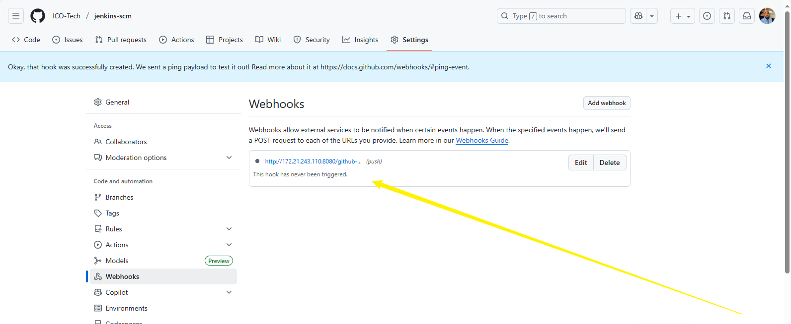

# jenkins-scm
```
Jenkins Freestyle Projects offer a simple, flexible way to automate software development tasks. They let you configure and customize jobs to manage builds, tests, and deployments efficiently. This introduction covers the basics, helping you set up and use Freestyle Projects to streamline your development workflow.
```
# Introductiion

## Jenkins Jobs
```
In Jenkins, a job is a defined unit of work or automation task executed by the Jenkins server. It acts as the foundation for automating various stages of the software development lifecycle—such as building, testing, packaging, and deploying applications. Each Jenkins job can represent a single task or a series of interconnected steps designed to streamline and standardize workflows across development environments.

Jenkins jobs are configured with customizable build steps, triggers, and post-build actions that define how and when automation should occur. They can be used to automatically compile code, run tests, create Docker images, or deploy applications whenever changes are made to a source code repository. This automation enables continuous integration and delivery (CI/CD), ensuring faster, more reliable, and consistent software deployment processes.
```
## Creating a Freestyle project
```
lets create our first build job
```
- From the dashboard menu on the left side, click on new item. 


-create a freestyle project and name it "jenkins-scm"


## ## Connecting Jenkins To Our Code Management
```
Now that we have ceated a freestle project, let connect jenkins with github.
```
- Create a new GitHub repository named jenkins-scm and add a README.md file.
- In Jenkins, open your project and go to Source Code Management → Git. Paste your GitHub repo URL in the field provided and make sure the branch name is set to main.
- Click Save, then select Build Now to connect Jenkins to your GitHub repository and start the first build.


```
Jenkins has been successfully connected to our GitHub repository named 'jenkins-scm', allowing it to access the code for building and automation.
```
## Configure Build Trigger
```
As engineers, we aim to automate repetitive tasks and make our workflow as efficient as possible. Although we have successfully connected Jenkins to our repository, jenkins-scm, we currently have to manually click "Build Now" to start a new build. This manual process can be time-consuming and prone to delays.

To streamline this, we need to configure a build trigger for our Jenkins job. By setting up a build trigger, Jenkins will automatically start a new build whenever a change is made to our repository, ensuring that our pipeline stays up-to-date without manual intervention. This enhances automation, reduces human effort, and ensures faster feedback on code changes.
```
## Follow the steps below to set up a build trigger from GitHub:

- Open your Jenkins job configuration:
- Navigate to your job and click on “Configure” to access the job settings.
- Set up the build trigger:
- In the configuration page, scroll down to the “Build Triggers” section.
- Select the option to trigger the job via GitHub webhook. This will allow Jenkins to automatically start a build whenever changes are pushed to the repository.


## create a github webhook using jenkins ip address and port.
## Get Your Jenkins URL
```
You need to know the exact Jenkins address reachable by GitHub.
```
```
hostname -I
```
```
Copy the Webhook Endpoint
GitHub needs a specific endpoint in Jenkins that listens for events:
```
```
http://<your-IP>:8080/github-webhook/
```
```
Go to Your GitHub Repository
Open your GitHub repo in your browser.
Click on Settings → Webhooks → Add webhook.
```
## Fill in Webhook Details
- Payload URL:
- Paste your Jenkins webhook endpoint
```
http://172.21.243.110:8080/github-webhook/
```
- Content type:
```
application/json
```
- Which events would you like to trigger this webhook?
- Choose:
```
Just the push event.
```
- Then click Add webhook.
## Configure Jenkins to Listen for Webhooks
- from your Jenkins job and:
- Click Configure.
- Scroll to Build Triggers.
- Check:
```
GitHub hook trigger for GITScm polling
```
click saved.



## Now to test the webhook

- Open Your Project Folder
In your local machine (where you cloned your GitHub repository) using cd command.
- Edit a simple file like README.md or any code file.
- Here i used the opportunity to document my project using README.md
- You can verify the change:
```
cat README.md
```
- Commit the Change: Now add and commit your changes:
```
git add .
git commit -m "Test Jenkins webhook connection"
```
- Push the Change to GitHub: Push the code to your repository:
```
git push origin main
```
- Observe Jenkins Automatically Build
- Now go to your Jenkins dashboard:
- Open your Freestyle project
- You should see a new build automatically start (without clicking “Build Now”)
- Jenkins console log will show something like:
```
Started by GitHub push by iyke-tech
Cloning the remote Git repository
...
Finished: SUCCESS
```
# Summary 
```
This project demonstrates how to set up a GitHub webhook to trigger Jenkins builds automatically. First, the Jenkins server’s IP address and port were identified to create a webhook endpoint (http://<your-IP>:8080/github-webhook/). This endpoint was then added to the GitHub repository under Settings → Webhooks, configured to send push events as JSON payloads. On the Jenkins side, the Freestyle job was configured to listen for these events by enabling “GitHub hook trigger for GITScm polling” in the Build Triggers section.

To test the setup, a simple change was made to a file (e.g., README.md) in the local repository, committed, and pushed to GitHub. Jenkins automatically detected the push and started a build without any manual action. The build process, visible in the Jenkins console, confirmed successful cloning of the repository and execution of the job, demonstrating a fully automated CI/CD workflow that links GitHub commits directly to Jenkins builds for faster feedback and seamless integration.
```


